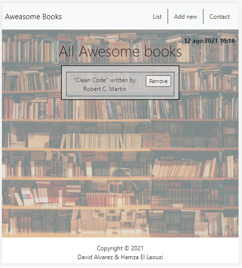

  
  
  
  
  

# Awesome books with JavaScript: 

## Learning objectives
- Deploy Application with Github Pages
- Keep practicing linters (HTML, css & JS)
- Contribution to project with Pair-pragramming method
- JavaScript objects and array
- Build a personal portfolio site.
- Learn JavaScript syntax and DOM interface
- Learn JavaScript classes
- Store data with local storage
- Single Page Apps

## Built With

- Major languages
  - HTML AND CSS
  - Linters, GIT
  - JavaScript
   -- Objects & Arrays
   -- JavaScript classes
   -- Store data with local storage

## Live Demo 

> Welcome to github page of my project

[Live Demo Link](https://petumazo.github.io/Awesome-books/)

## Getting Started

To get a local copy up and running follow these simple example steps.

- Open your terminal and navigate to the directory where you want to copy the project.
- Run on your terminal `git clone git@github.com:petumazo/Awesome-books.git`.
- Run on yout terminal `cd Awesome-books`.
- Open the file `index.html` file.

### Setup

linters set Up

Node updated version

## Authors

👤 **EllaouziHamza**
👤 **DavidAlvarez**

- GitHub: [petumazo](https://github.com/petumazo)
- GitHub: [hamzaoutdoors](https://github.com/Hamzaoutdoors)

## 🤝 Contributing

Contributions, issues, and feature requests are welcome!

Feel free to check the [issues page](https://github.com/petumazo/Awesome-books/issues).

## Show your support

Give a ⭐️ if you like this project!

## Acknowledgments

- Module 2 : 
 -- project Awesome Books (Awesome books: refactor to use JavaScript classes)

## 📝 License

This project is [MIT](https://github.com/git/git-scm.com/blob/main/MIT-LICENSE.txt) licensed.

